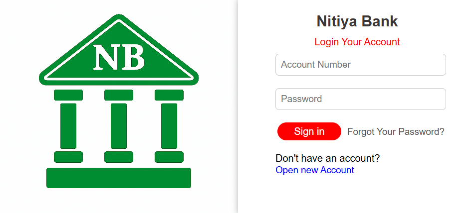
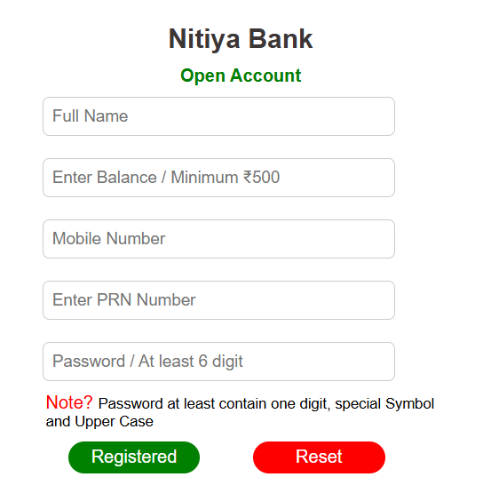
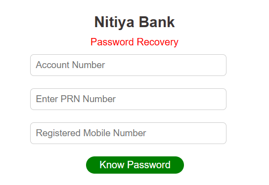
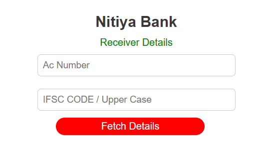
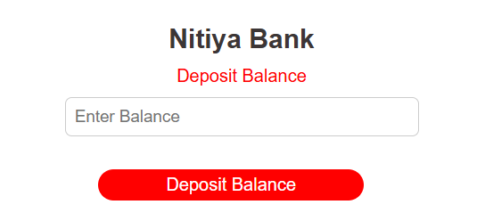
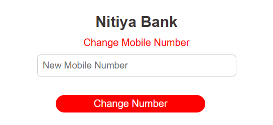
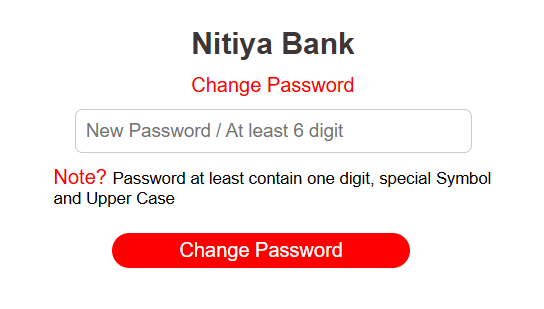

# Bank Management System

A Minor Project developed as part of the B.Tech (CSE) curriculum.

## 📸 Project Images

## Login Page

## Open Account

## Password Recover

## Transfer Balance

## Deposit Balance

## Change Mobile Number

## Change Password

## 📘 Abstract

The **Bank Management System (BMS)** is a secure and efficient web-based application that streamlines essential banking operations for users and administrators. It replaces traditional manual systems with a centralized digital solution that supports customer registration, account management, transactions (deposit, withdrawal), balance checks, and statement generation.

## 🎯 Objectives

- Provide a digital platform for core banking operations.
- Eliminate manual errors and delays through automation.
- Ensure secure and fast access to banking services.
- Simplify tasks for both customers and administrators.

---

## 🔑 Key Features

### ➤ Account Management
- Customer registration with personal & financial data
- View/update customer information

### ➤ Transaction Management
- Deposit and withdrawal functionality
- View transaction history

### ➤ Balance & Statement Inquiry
- Real-time balance checks
- Generate account statements (monthly/yearly)

### ➤ Security & Authentication
- User login with two-layer authentication (username & password)

---

## 🧩 System Modules

- **User Registration Module** – For new customer account creation.
- **Login Module** – Secure access using authentication.
- **Banking Functions Module** – Balance checks, deposit, withdrawal, and transaction history.

---

## 🛠️ Technologies Used

| Category        | Tools / Languages                          |
|----------------|---------------------------------------------|
| Frontend       | HTML, CSS, JavaScript, JSP                  |
| Backend        | Java (JDK 24), JDBC, Servlets               |
| Database       | Oracle 11g XE / MySQL 8.0+                  |
| Web Server     | Apache Tomcat 9                             |
| IDE            | IntelliJ IDEA / Eclipse                     |
| OS             | Windows 10/11 or Ubuntu 20.04+              |
| Browser        | Chrome / Edge                               |
| Cloud Hosting  | AWS EC2 (Ubuntu 20.04 LTS)                  |
| Version Control| Git (Git Bash)                              |
| File Transfer  | FileZilla                                   |

## ☁️ Deployment Architecture

- **Web Tier**: Apache Tomcat 9 on AWS EC2
- **Application Tier**: Java Servlet, JSP, JDBC
- **Database Tier**: MySQL (local or remote access)
- **Client Side**: Web browser (Chrome/Edge) via HTTP
- **Security**: AWS Security Groups for HTTP/HTTPS & MySQL (port 3306)

